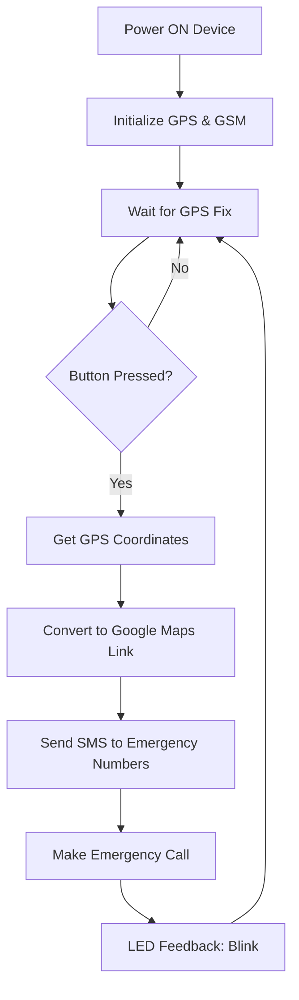

<h1 align="center">
  🚨 SOS Emergency Device
  <br />
  <sub>GPS + GSM Tracker · One Button to Save Lives 🆘</sub>
</h1>

<p align="center">
  
  
  
  
  
</p>

<p align="center">
  <b>An emergency alert system that sends your exact location via SMS and calls for help with one button.</b>
  <br />
  <i>Built with Arduino Uno, SIM900L GSM, and NEO-6M GPS.</i>
</p>

---

## 📖 Table of Contents

- [💡 Concept & Inspiration](#-concept--inspiration)
- [⚙️ System Architecture](#️-system-architecture)
- [✨ Unique Features](#-unique-features)
- [🧩 Hardware Bill of Materials](#-hardware-bill-of-materials-bom)
- [🔌 Pin Mapping (Wiring Diagram)](#-pin-mapping-wiring-diagram)
- [💻 Software Architecture](#-software-architecture)
- [🚀 Getting Started](#-getting-started-setup--upload)
- [📱 How It Works](#-how-it-works)
- [🏠 Real-World Applications](#-real-world-applications)
- [🔮 Future Upgrades & Ideas](#-future-upgrades--ideas)
- [🤝 Acknowledgments](#-acknowledgments)

---

## 💡 Concept & Inspiration

In emergencies, every second counts. But in Bangladesh and many developing countries, emergency services often lack precise location information, leading to delayed responses.

This project solves that problem by creating a **portable, standalone SOS device** that:
- 🔴 Sends an **SMS with GPS coordinates** to pre-saved emergency contacts
- 📞 Makes an **automatic voice call** to the emergency number
- 🗺️ Provides **real-time location tracking** via Google Maps link

> 🎯 **Real-World Use Case:** Elderly individuals, solo travelers, women in distress, or anyone in an emergency can press a single button to instantly alert their family and emergency services with their exact location.

---

## ⚙️ System Architecture


---
## ✨ Unique Features

| Feature | How It Works |
| :--- | :--- |
| 🆘 **One-Button Emergency** | Press a single button to trigger the entire alert sequence. |
| 📍 **GPS Location Tracking** | Uses NEO-6M GPS to get precise latitude and longitude. |
| 📱 **Auto SMS Alert** | Sends a Google Maps link with the exact location to 2+ emergency contacts. |
| 📞 **Auto Voice Call** | Makes a call to the primary emergency contact for immediate verbal communication. |
| 🔔 **LED Feedback** | Flashing LED indicates the device is working and alerts have been sent. |
| 🪫 **Standalone Operation** | Works without a smartphone — perfect for elderly or non-tech users. |
| 🔋 **Battery Powered** | Can be powered with a 9V battery for portable use. |
| 💾 **SIM Card Ready** | Works with any GSM network using a standard SIM card. |

---
🧩 Hardware Bill of Materials (BOM)
Component	Quantity	Purpose
Arduino Uno R3	1	Main microcontroller
SIM900L GSM Module	1	Sends SMS and makes calls
NEO-6M GPS Module	1	Gets real-time location coordinates
Push Button	1	Emergency trigger
LED (Any Color)	1	Visual feedback indicator
Resistor (220Ω)	1	Current limiting for LED
SIM Card (Active)	1	For GSM connectivity
9V Battery (with connector)	1	Portable power source
Jumper Wires	Several	Connections
Breadboard / PCB	1	Circuit assembly
⚠️ Note: You need an active SIM card with SMS and call credit for this to work.

🔌 Pin Mapping (Wiring Diagram)
Component	Pin	Arduino Pin
SIM900L	VCC	5V
GND	GND
TX	D9
RX	D10
NEO-6M GPS	VCC	5V
GND	GND
TX	D3
RX	D4
Push Button	One Leg	D7
Other Leg	GND
LED	Anode (+)	D8 (via 220Ω)
Cathode (-)	GND
💻 Software Architecture
The device follows a simple but effective logic flow:

1. Initialization
GPS module starts searching for satellites

GSM module initializes and checks network connection

LED blinks to indicate the device is ready

2. Waiting Mode
The device waits for the button to be pressed

GPS continuously updates location data

3. Emergency Trigger
When the button is pressed:

Get GPS Location – Reads latitude and longitude

Format Message – Creates a Google Maps link:

text
EMERGENCY! I need help at: 
https://maps.google.com/maps?q=23.8103,90.4125
Send SMS – Sends the message to saved emergency contacts

Make Call – Calls the primary emergency contact

LED Blink – Confirms that alerts have been sent

🚀 Getting Started (Setup & Upload)
1. Clone the Repository
bash
git clone https://github.com/riad42-iot/Sos-device-using-sim900-and-arduino-uno-and-a-gps-tracker.git
cd Sos-device-using-sim900-and-arduino-uno-and-a-gps-tracker
2. Install Required Libraries
Open Arduino IDE and install:

SoftwareSerial.h (built-in)

TinyGPS++.h – for GPS data parsing

3. Configure Emergency Contacts
Open the .ino file and replace:

cpp
String emergencyNumbers[] = {"+8801XXXXXXXXX", "+8801XXXXXXXXX"}; // Your contacts
4. Upload the Code
Select board: Tools → Board → Arduino Uno

Select port: Tools → Port → (your COM port)

Click Upload.

5. Test the Device
Power the device

Wait for GPS to get a fix (blue LED on GPS module will blink)

Press the emergency button

Check your phone for the SMS and missed call

📱 How It Works
What Happens When You Press the Button
Step	Action
1️⃣	Device gets GPS coordinates (latitude & longitude)
2️⃣	Creates a Google Maps link with the location
3️⃣	Sends SMS to all saved emergency contacts
4️⃣	Makes an automatic voice call to the primary contact
5️⃣	LED blinks to confirm alerts were sent
Sample SMS Received
text
EMERGENCY! I need help at:
https://maps.google.com/maps?q=23.8103,90.4125
When the recipient clicks the link, it opens Google Maps showing the exact location of the sender!

🏠 Real-World Applications
Scenario	Why This Matters
Elderly Care	Seniors can call for help if they fall or feel unwell.
Women's Safety	Women in distress can alert family and authorities discreetly.
Travel Safety	Solo travelers can send their location if they get lost or face danger.
Child Safety	Children can use it to alert parents in emergencies.
Outdoor Activities	Hikers, fishermen, and remote workers can call for rescue.
Medical Emergencies	Patients with chronic conditions can call for immediate help.
🔮 Future Upgrades & Ideas
Take this project to the next level:

Upgrade	Description
📡 IoT Integration	Send alerts to a cloud dashboard (AWS/Azure) using MQTT.
📱 Mobile App	Build a Flutter app to receive and display SOS alerts on a map.
🗺️ Real-Time Tracking	Continuously track the device's location on a live map.
🔊 Siren/Alarm	Add a loud buzzer to deter attackers.
🔋 Battery Optimization	Use deep sleep modes for months of battery life.
📶 Signal Strength	Add an LED to show GSM signal strength.
🔐 Authentication	Add a PIN code to prevent false alarms.
📸 Camera Integration	Capture and send a photo along with the location.
🌐 4G Upgrade	Upgrade to 4G/LTE for faster communication.
💬 Two-Way Communication	Allow the contact to reply and confirm help is on the way.
🤝 Acknowledgments
Built with ❤️ by Md. Al-Riad at UFTB.

Powered by Arduino, SIM900L, and NEO-6M GPS.

Inspired by the need for affordable, accessible emergency solutions in Bangladesh.

<p align="center">  </p><p align="center"> <b>Made with ❤️, C++, and the will to save lives by Md. Al-Riad</b> <br /> <i>One button — instant help, anywhere.</i> <br /><br />    </p> ```
📝Coordinates]
    E --> F[Convert to Google Maps Link]
    F --> G[Send SMS to Emergency Numbers]
    G --> H[Make Emergency Call]
    H --> I[LED Feedback: Blink]
    I --> C
✨ Unique Features
Feature	How It Works
🆘 One-Button Emergency	Press a single button to trigger the entire alert sequence.
📍 GPS Location Tracking	Uses NEO-6M GPS to get precise latitude and longitude.
📱 Auto SMS Alert	Sends a Google Maps link with the exact location to 2+ emergency contacts.
📞 Auto Voice Call	Makes a call to the primary emergency contact for immediate verbal communication.
🔔 LED Feedback	Flashing LED indicates the device is working and alerts have been sent.
🪫 Standalone Operation	Works without a smartphone — perfect for elderly or non-tech users.
🔋 Battery Powered	Can be powered with a 9V battery for portable use.
💾 SIM Card Ready	Works with any GSM network using a standard SIM card.
🧩 Hardware Bill of Materials (BOM)
Component	Quantity	Purpose
Arduino Uno R3	1	Main microcontroller
SIM900L GSM Module	1	Sends SMS and makes calls
NEO-6M GPS Module	1	Gets real-time location coordinates
Push Button	1	Emergency trigger
LED (Any Color)	1	Visual feedback indicator
Resistor (220Ω)	1	Current limiting for LED
SIM Card (Active)	1	For GSM connectivity
9V Battery (with connector)	1	Portable power source
Jumper Wires	Several	Connections
Breadboard / PCB	1	Circuit assembly
⚠️ Note: You need an active SIM card with SMS and call credit for this to work.

🔌 Pin Mapping (Wiring Diagram)
Component	Pin	Arduino Pin
SIM900L	VCC	5V
GND	GND
TX	D9
RX	D10
NEO-6M GPS	VCC	5V
GND	GND
TX	D3
RX	D4
Push Button	One Leg	D7
Other Leg	GND
LED	Anode (+)	D8 (via 220Ω)
Cathode (-)	GND
💻 Software Architecture
The device follows a simple but effective logic flow:

1. Initialization
GPS module starts searching for satellites

GSM module initializes and checks network connection

LED blinks to indicate the device is ready

2. Waiting Mode
The device waits for the button to be pressed

GPS continuously updates location data

3. Emergency Trigger
When the button is pressed:

Get GPS Location – Reads latitude and longitude

Format Message – Creates a Google Maps link:

text
EMERGENCY! I need help at: 
https://maps.google.com/maps?q=23.8103,90.4125
Send SMS – Sends the message to saved emergency contacts

Make Call – Calls the primary emergency contact

LED Blink – Confirms that alerts have 
